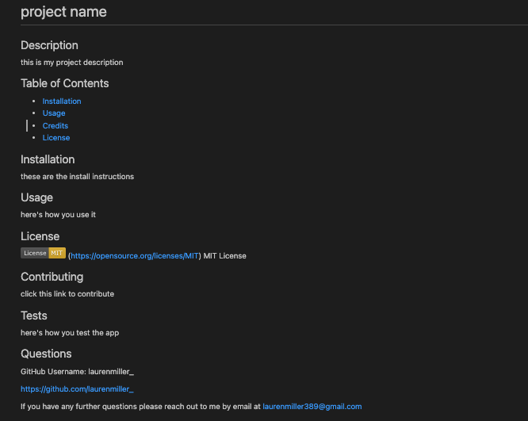

# hw9-readme

## Description

This project is a readMe generator to help facilitate the creation of a user's project instructions.

## Table of Contents

- [Installation](#installation)
- [Usage](#usage)
- [Credits](#credits)
- [License](#license)

## Installation

This project requires installations of Node.js. Here's where you can download the package:
- Node: https://nodejs.org/en/download

## Usage

To get the application running, type 'node index' into your terminal and fill out the prompts in your command line to generate your readMe. You can find your completed readMe written to the file titled 'README.md' 

Here's a link to my demo: https://drive.google.com/file/d/1bJI5cWxBhw1KVVEfNZleJpP0Vui7xG-b/view

## Credits

Columbia University Coding Bootcamp

## License

MIT License

## How to Contribute

Keep tabs on the [Contributor Covenant](https://www.contributor-covenant.org/)!

## Tests

There's no testing required for this project